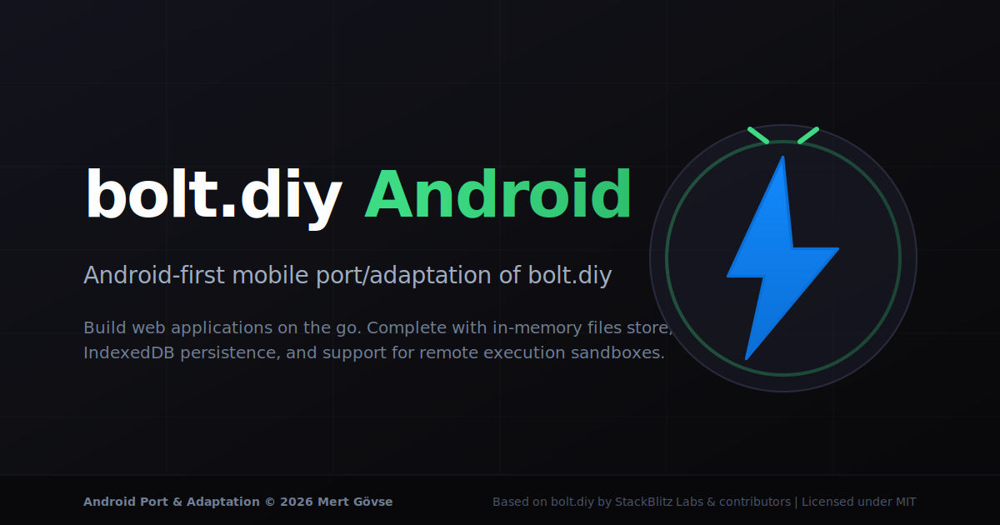

# bolt.diy Android



> **Android port & adaptation © 2026 Mert Gövse.**  
> Based on **bolt.diy** by **StackBlitz Labs** and contributors.  
> Original MIT license and notices are fully retained.

[](./LICENSE)
[](https://github.com/mertgoevse-wq/bolt-diy-android/pulls)

---

## What is bolt.diy Android?

**bolt.diy Android** is an optimized mobile port and adaptation of [bolt.diy](https://github.com/stackblitz-labs/bolt.diy), the popular web-based AI coding assistant. This project wraps the web application in a native Android WebView shell using [Capacitor](https://capacitorjs.com/), while introducing fallback UI panels and adapters to make coding on mobile responsive, stable, and offline-ready.

By decoupling the layout from desktop-only assumptions, bolt.diy Android allows you to chat with LLMs, prompt code generation, browse files, and write code on a standard mobile device (such as the Samsung Galaxy A56).

---

## About this Repository

- **Description**: Android-first mobile port/adaptation of bolt.diy with Capacitor, local IndexedDB fallback persistence, and Android WebView support.
- **Topics**: `android`, `capacitor`, `webview`, `bolt-diy`, `ai-coding-assistant`, `typescript`, `react`, `vite`, `indexeddb`, `mobile`, `open-source`
- **Social Preview**: [bolt-diy-android-social-preview.svg](./public/bolt-diy-android-social-preview.svg)

---

## Android Status Table

| Feature | Status | Notes |
|---------|--------|-------|
| **Capacitor WebView Shell** | ✅ Complete | Loads a pure SPA build directly inside native APK assets |
| **LLM Chat & Prompting** | ✅ Works | Compatible with OpenAI, Anthropic, Google Gemini, Ollama, etc. |
| **File Editor (CodeMirror)** | ✅ Works | Touch editor controls, copy/paste, and auto-save |
| **File Persistence** | ✅ IndexedDB | Workspace files persist locally in IndexedDB across application restarts |
| **Touch DnD Backend** | ✅ Complete | Layout elements drag-and-drop behaves on touchscreens |
| **Mobile Bottom Navigation** | ✅ Complete | Responsive Tab UI for switching between Chat, Editor, Preview, and Terminal |
| **Designed Terminal Fallback** | ⚠️ Fallback UX | xterm shell is replaced by a polished guide redirecting to Remote Settings |
| **Designed Preview Fallback** | ⚠️ Fallback UX | Live server is unavailable; supports **Local Static HTML Preview** via Blob URLs |
| **WebContainer Interception** | ✅ Safe | Intercepts commands (npm install, shell, start) and fails gracefully with toasts |
| **Remote Runtime Section** | ✅ Complete | Mobile UI in Settings to configure and save a Remote Runtime URL |
| **Automated APK Builds** | ✅ Scripted | Build debug APKs in one command from your terminal |

---

## Key Features

- 📱 **Mobile Responsive Layout**: Swappable tab sheets optimized for vertical viewports (such as 1080×2340 viewports).
- 💾 **Local File Persistence**: IndexedDB adapter automatically restores your project files upon app relaunch.
- ⚡ **Offline-Ready UI Shell**: Runs as a pure Client-Side Rendered (CSR) app. No active Node.js server or Cloudflare environment is required to load the app UI.
- 🖼️ **Local Static HTML Preview**: Compile your `index.html` file into local blobs to test layouts offline in the Preview window.
- 🛰️ **Remote Runtime Readiness**: Configuration fields are ready in the mobile settings panel to link with future remote command-execution sandboxes.

---

## Quick Start & Web Preview

### Prerequisites

1. **Node.js** ≥ 18.18
2. **npm** (legacy-peer-deps enabled)
3. **Android SDK & Studio** (for native builds)

### 1. Setup & Installation

```bash
# Clone the repository
git clone https://github.com/mertgoevse-wq/bolt-diy-android.git
cd bolt-diy-android

# Install dependencies
npm install --legacy-peer-deps
```

### 2. Run the Local Web Preview

To run the Android WebView shell configuration in your browser (no server dependencies required):

```bash
# Start Vite development server in Android SPA mode
npm run android:dev

# Or preview the production SPA bundle locally on localhost
npm run android:webbuild
npm run android:webpreview
```

### 3. Expose Preview on Wi-Fi (Host 0.0.0.0)

To open the web version on your physical phone (on the same Wi-Fi network):

```bash
# Run dev server exposed to local network
npm run android:dev:host

# Run production preview exposed to local network
npm run android:webpreview:host
```

---

## APK Build Instructions

To build a native Android package (`.apk`):

```bash
# Compile web assets, sync Capacitor, and generate Debug APK in one step:
npm run android:apk:debug
```

Once the process finishes, the compiled artifact is generated at:
`android/app/build/outputs/apk/debug/app-debug.apk`

- **Open in Android Studio**: Run `npm run android:open`
- **Deploy to connected USB device**: Run `npm run android:run`
- **Release builds**: Running `npm run android:apk:release` compiles the release target. Note that signing keys must be configured in `android/app/build.gradle` to produce a signed distributable APK.

---

## Limitations & Fallback UX

Since standard Android WebViews do not support `SharedArrayBuffer` and WebContainers, the following stubs are implemented:
1. **Terminal**: Displays a friendly fallback card explaining the limitation, with a direct link to Settings.
2. **Preview**: If the workspace files contain an `index.html` file, a **"Run Basic Static Preview"** button compiles it into an offline Blob URL inside the frame. An asset warning banner is rendered at the top of the frame. If no `index.html` is found, a setup instruction is shown instead.
3. **Command Runner**: Any shell/build commands triggered by LLM outputs are captured, flagged as completed/failed, and trigger a brief Toast warning instead of causing UI freezes.

---

## Roadmap

- [ ] **Mobile UI Pass**: Restyle chat buttons and dialogs to prevent overflow on 360px wide devices.
- [ ] **Remote Runtime Server**: Implement a lightweight Node.js/Docker sandbox backend that executes the terminal commands remotely.
- [ ] **Native File Picker**: Hook Capacitor Filesystem API to export/import files into the phone's native storage.
- [ ] **Signed APK Releases**: Add automatic workflow generation for production APK releases.

---

## Licensing & Attribution

This project is a fork and adaptation of the original open-source project **bolt.diy**. 

- **Original Project**: [bolt.diy by StackBlitz Labs](https://github.com/stackblitz-labs/bolt.diy)
- **License**: MIT (Retained in full in [LICENSE](./LICENSE))
- **Trademarks & Copyright**: All original trademarks and logos belong to StackBlitz Labs and contributors. This adaptation uses "bolt.diy Android" solely for descriptive purposes and features distinct logos (`public/bolt-diy-android-logo.svg`, `public/bolt-diy-android-icon.svg`).
