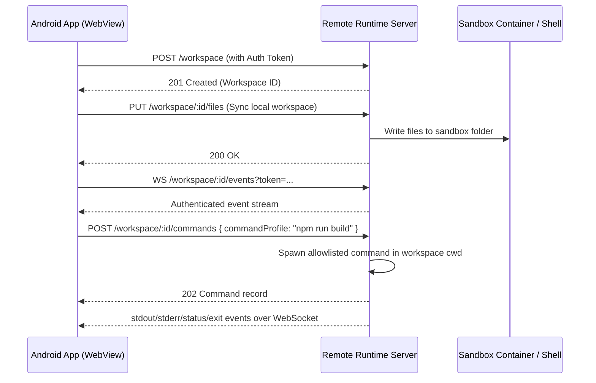

# Remote Runtime Design & Specification

This document details the architecture, secure communication model, API contract, and client interface for the **bolt.diy Android Remote Runtime**.

---

## 1. Overview & Architecture

Since WebContainer and native command execution are unavailable in standard mobile WebViews, bolt.diy Android can optionally connect to a **Remote Runtime Server**. Android IndexedDB remains the local source of truth for files. Phase 5.4 adds safe command execution using predefined allowlisted command profiles only; free-form shell input is not supported.



---

## 2. API Contract

All REST endpoints require the HTTP Header: `Authorization: Bearer <token>`.

### 2.1 REST Endpoints

#### `GET /health`
- **Description:** Verifies connectivity, authentication, and backend status.
- **Request Headers:**
  - `Authorization: Bearer <token>`
- **Response:**
  - `200 OK`
  - Body:
    ```json
    {
      "status": "healthy",
      "version": "1.0.0",
      "docker": "available"
    }
    ```

#### `POST /workspace`
- **Description:** Creates a clean workspace sandbox folder/container on the server.
- **Request Body:**
  ```json
  {
    "template": "node-clean"
  }
  ```
- **Response:**
  - `201 Created`
  - Body:
    ```json
    {
      "workspaceId": "ws_abc123xyz",
      "createdAt": "2026-07-04T18:13:00Z"
    }
    ```

#### `GET /workspace/:id/files`
- **Description:** Retrieves remote file metadata. Add `?includeContent=true` to include text-safe file contents.
- **Response:** `200 OK`
  ```json
  {
    "files": [
      {
        "path": "src/App.tsx",
        "type": "file",
        "size": 1200,
        "modifiedAt": "2026-07-04T18:13:00.000Z",
        "content": "export default function App() {}",
        "isBinary": false
      }
    ]
  }
  ```

#### `GET /workspace/:id/files/content?path=src/App.tsx`
- **Description:** Reads a single text-safe file from the remote workspace.
- **Response:** `200 OK`
  ```json
  {
    "path": "src/App.tsx",
    "content": "export default function App() {}",
    "size": 1200,
    "modifiedAt": "2026-07-04T18:13:00.000Z"
  }
  ```

#### `PUT /workspace/:id/files`
- **Description:** Syncs text files from the local IndexedDB-backed Android workspace to the remote workspace.
- **Request Body:** JSON file mapping only.
  ```json
  {
    "files": {
      "index.html": "<h1>Hello</h1>",
      "src/main.ts": "console.log('hello')"
    }
  }
  ```
- **Response:** `200 OK`
  ```json
  {
    "ok": true,
    "writtenFileCount": 2,
    "files": [
      { "path": "index.html", "type": "file", "size": 14, "modifiedAt": "2026-07-04T18:13:00.000Z" }
    ]
  }
  ```
- **MVP constraints:** nested directories are supported, path traversal is blocked, and non-text-safe payloads are rejected.

#### `POST /workspace/:id/commands`
- **Description:** Starts one safe predefined command profile inside the workspace directory.
- **Security:** No arbitrary shell input is accepted. Request body must contain `commandProfile`.
- **Request Body:**
  ```json
  {
    "commandProfile": "npm run build"
  }
  ```
- **Allowed profiles:**
  - `npm install`
  - `npm run dev`
  - `npm run build`
  - `pnpm install`
  - `pnpm run dev`
  - `pnpm run build`
- **Response:** `202 Accepted`
  ```json
  {
    "commandId": "cmd_abc123xyz",
    "commandProfile": "npm run build",
    "workspaceId": "ws_abc123xyz",
    "status": "running",
    "startedAt": "2026-07-05T10:00:00.000Z"
  }
  ```
- **Runtime behavior:** command runs with `cwd` set to the workspace path, uses fixed allowlisted arguments, streams output over WebSocket, and is stopped after `REMOTE_RUNTIME_COMMAND_TIMEOUT_MS` or the default timeout.
- **Windows note:** npm/pnpm profiles launch through `cmd.exe /d /s /c` with static profile arguments so `.cmd` package-manager shims work; the client still cannot provide arbitrary command text.

#### `GET /workspace/:id/commands/:commandId`
- **Description:** Returns current command status.
- **Response:** `200 OK`
  ```json
  {
    "commandId": "cmd_abc123xyz",
    "commandProfile": "npm run build",
    "workspaceId": "ws_abc123xyz",
    "status": "exited",
    "startedAt": "2026-07-05T10:00:00.000Z",
    "endedAt": "2026-07-05T10:00:12.000Z",
    "exitCode": 0,
    "signal": null
  }
  ```

#### `POST /workspace/:id/commands/:commandId/stop`
- **Description:** Requests termination of a running command.
- **Behavior:** Stops the command process; on Windows, the process tree is terminated so npm/pnpm child processes do not keep running after the wrapper exits.
- **Response:** `200 OK` with the updated command record.

#### `GET /workspace/:id/preview`
- **Description:** Returns the active port mapping and public tunnel preview URL if a dev server is running.
- **Response:**
  - `200 OK`
  - Body:
    ```json
    {
      "port": 5173,
      "previewUrl": "https://preview-ws-123.runtime.host"
    }
    ```

---

### 2.2 WebSocket Channel: `WS /workspace/:id/events`

Used to stream command output and live status updates for allowlisted command profiles.

The Android terminal fallback uses these events to render command output and a compact status panel with the last command profile, command ID, status, last output timestamp, and exit code.

#### Client Messages (App → Server)
- Free-form WebSocket input is disabled in Phase 5.4.
- Commands are started with `POST /workspace/:id/commands`.
- Commands are stopped with `POST /workspace/:id/commands/:commandId/stop`.
- Any client WebSocket message is ignored and receives a status response:
  ```json
  {
    "type": "status",
    "payload": {
      "status": "input_ignored",
      "output": "Free-form terminal input is disabled. Use command profiles only.\n"
    }
  }
  ```

#### Server Messages (Server → App)
- **Terminal Output Stream (stdout/stderr):**
  ```json
  {
    "type": "stdout",
    "timestamp": "2026-07-05T10:00:01.000Z",
    "payload": {
      "commandId": "cmd_abc123xyz",
      "commandProfile": "npm run build",
      "output": "vite build..."
    }
  }
  ```
- **Process Lifecycle Events:**
  ```json
  {
    "type": "exit",
    "timestamp": "2026-07-05T10:00:12.000Z",
    "payload": {
      "commandId": "cmd_abc123xyz",
      "commandProfile": "npm run build",
      "status": "exited",
      "exitCode": 0
    }
  }
  ```
---

## 3. Security Requirements
1. **Token Authentication:** Every REST request and WebSocket connection upgrade MUST be validated with a cryptographically secure token.
2. **Sandbox Isolation:** Each workspace ID must map to a separate directory (under `remote-runtime/workspaces/`). Strict resolution checks are enforced to block traversal attempts.
3. **Encrypted Traffic:** All endpoints must be served over HTTPS/WSS in production.
4. **Command Profiles Only:** Remote command execution accepts only the documented `commandProfile` values. The server never executes user-provided shell strings or args.
5. **Workspace CWD:** Commands run only with `cwd` set to the resolved workspace directory.
6. **Timeouts:** Commands are terminated after `REMOTE_RUNTIME_COMMAND_TIMEOUT_MS` or the default timeout.

---

## 4. Local Setup & Testing Guide

### 4.1 Running the Server
The remote runtime package resides in `remote-runtime/`.

1. **Configure Environment:**
   Create a `.env` in the root workspace or in `remote-runtime/` using the following:
   ```env
   REMOTE_RUNTIME_TOKEN=change-me
   REMOTE_RUNTIME_PORT=8787
   REMOTE_RUNTIME_HOST=0.0.0.0
   REMOTE_RUNTIME_COMMAND_TIMEOUT_MS=300000
   ```

2. **Boot the Server:**
   Using root scripts:
   ```bash
   npm run runtime:dev
   ```

When testing from a phone, `localhost` and `127.0.0.1` point to the phone, not your laptop. Use the laptop LAN IP in Android settings, for example `http://192.168.x.x:8787`.

### 4.2 Verifying Endpoints

1. **Health Query:**
   ```bash
   curl -i http://127.0.0.1:8787/health
   ```

2. **Create Workspace:**
   ```bash
   curl -i -X POST -H "Authorization: Bearer change-me" http://127.0.0.1:8787/workspace
   ```

3. **Safe File Sync:**
   ```bash
   curl -i -X PUT -H "Authorization: Bearer change-me" -H "Content-Type: application/json" -d '{"files": {"index.html": "<h1>Hello</h1>"}}' http://127.0.0.1:8787/workspace/ws_example123/files
   ```

4. **Safe Command Profile:**
   ```bash
   curl -i -X POST -H "Authorization: Bearer change-me" -H "Content-Type: application/json" -d '{"commandProfile":"npm run build"}' http://127.0.0.1:8787/workspace/ws_example123/commands
   ```

## 5. File Sync Semantics

- Push: sends all local IndexedDB text files to Remote Runtime.
- Pull: reads the remote file list/content and writes only missing or identical files into local fallback storage after the user presses Pull.
- Conflict policy: local wins by default. If a local text file differs from remote content, the pull records a conflict and keeps the IndexedDB copy.
- Binary files: skipped for now with warnings in sync status.
- Desktop/WebContainer mode: unchanged; Remote Runtime remains optional.
