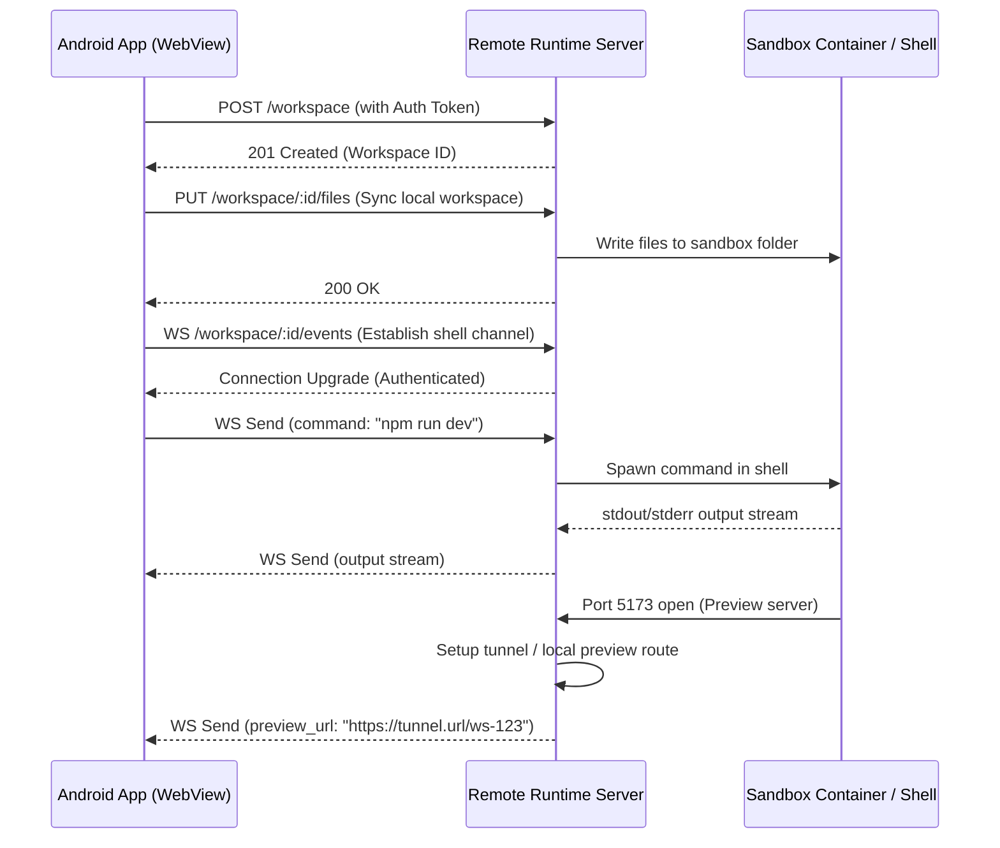

# Remote Runtime Design & Specification

This document details the architecture, secure communication model, API contract, and client interface for the **bolt.diy Android Remote Runtime**.

---

## 1. Overview & Architecture

Since WebContainer and native command execution are unavailable in standard mobile WebViews, bolt.diy Android relies on a **Remote Runtime Server** to execute terminal actions, install packages, and serve live previews.



---

## 2. API Contract

All REST endpoints require the HTTP Header: `Authorization: Bearer <token>`.

### 2.1 REST Endpoints

#### `GET /health`
- **Description:** Verifies connectivity, authentication, and backend status.
- **Request Headers:**
  - `Authorization: Bearer <token>`
- **Response:**
  - `200 OK`
  - Body:
    ```json
    {
      "status": "healthy",
      "version": "1.0.0",
      "docker": "available"
    }
    ```

#### `POST /workspace`
- **Description:** Creates a clean workspace sandbox folder/container on the server.
- **Request Body:**
  ```json
  {
    "template": "node-clean"
  }
  ```
- **Response:**
  - `201 Created`
  - Body:
    ```json
    {
      "workspaceId": "ws_abc123xyz",
      "createdAt": "2026-07-04T18:13:00Z"
    }
    ```

#### `GET /workspace/:id/files`
- **Description:** Retrieves the list of files and metadata in the remote workspace.
- **Response:** `200 OK` with JSON file tree.

#### `PUT /workspace/:id/files`
- **Description:** Syncs files from the local SQLite/IndexedDB store to the remote workspace.
- **Request Body:** Multi-part file stream or JSON file mapping.
- **Response:** `200 OK`.

#### `POST /workspace/:id/commands`
- **Description:** Direct trigger for short-running commands (e.g. `npm install`).
- **Request Body:**
  ```json
  {
    "command": "npm install",
    "args": ["--legacy-peer-deps"]
  }
  ```
- **Response:** `202 Accepted` (execution status streamed over WebSocket).

#### `GET /workspace/:id/preview`
- **Description:** Returns the active port mapping and public tunnel preview URL if a dev server is running.
- **Response:**
  - `200 OK`
  - Body:
    ```json
    {
      "port": 5173,
      "previewUrl": "https://preview-ws-123.runtime.host"
    }
    ```

---

### 2.2 WebSocket Channel: `WS /workspace/:id/events`

Used to stream terminal input, output, process control, and live status updates.

#### Client Messages (App → Server)
- **Initiate Terminal Session:**
  ```json
  { "type": "terminal_start", "cols": 80, "rows": 24 }
  ```
- **Send Terminal Keystroke / Stdin:**
  ```json
  { "type": "stdin", "data": "ls -la\n" }
  ```
- **Resize Terminal:**
  ```json
  { "type": "resize", "cols": 90, "rows": 30 }
  ```
- **Terminate Process:**
  ```json
  { "type": "kill", "signal": "SIGINT" }
  ```

#### Server Messages (Server → App)
- **Terminal Output Stream (stdout/stderr):**
  ```json
  { "type": "stdout", "data": "\u001b[34mpackage.json\u001b[0m\r\n" }
  ```
- **Process Lifecycle Events:**
  ```json
  { "type": "exit", "code": 0 }
  ```
- **Port Opened Notification (Dev Server Ready):**
  ```json
  { "type": "port_open", "port": 5173, "url": "https://preview-ws-123.runtime.host" }
  ```

---

## 3. Security Requirements
1. **Token Authentication:** Every REST request and WebSocket connection upgrade MUST be validated with a cryptographically secure token.
2. **Sandbox Isolation:** Each workspace ID must map to a separate Docker container or unprivileged user account to prevent directory traversal or remote code execution outside the workspace boundary.
3. **Encrypted Traffic:** All endpoints must be served over HTTPS/WSS.
