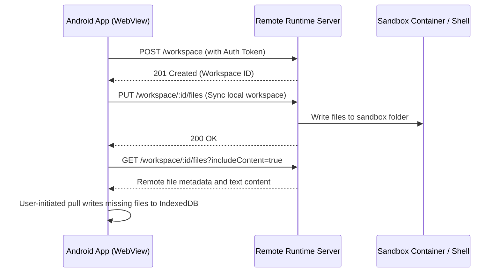

# Remote Runtime Design & Specification

This document details the architecture, secure communication model, API contract, and client interface for the **bolt.diy Android Remote Runtime**.

---

## 1. Overview & Architecture

Since WebContainer and native command execution are unavailable in standard mobile WebViews, bolt.diy Android can optionally connect to a **Remote Runtime Server**. Phase 5.3 implements a file-sync MVP only: Android IndexedDB remains the local source of truth, text files can be pushed/pulled explicitly, and command execution remains stubbed.



---

## 2. API Contract

All REST endpoints require the HTTP Header: `Authorization: Bearer <token>`.

### 2.1 REST Endpoints

#### `GET /health`
- **Description:** Verifies connectivity, authentication, and backend status.
- **Request Headers:**
  - `Authorization: Bearer <token>`
- **Response:**
  - `200 OK`
  - Body:
    ```json
    {
      "status": "healthy",
      "version": "1.0.0",
      "docker": "available"
    }
    ```

#### `POST /workspace`
- **Description:** Creates a clean workspace sandbox folder/container on the server.
- **Request Body:**
  ```json
  {
    "template": "node-clean"
  }
  ```
- **Response:**
  - `201 Created`
  - Body:
    ```json
    {
      "workspaceId": "ws_abc123xyz",
      "createdAt": "2026-07-04T18:13:00Z"
    }
    ```

#### `GET /workspace/:id/files`
- **Description:** Retrieves remote file metadata. Add `?includeContent=true` to include text-safe file contents.
- **Response:** `200 OK`
  ```json
  {
    "files": [
      {
        "path": "src/App.tsx",
        "type": "file",
        "size": 1200,
        "modifiedAt": "2026-07-04T18:13:00.000Z",
        "content": "export default function App() {}",
        "isBinary": false
      }
    ]
  }
  ```

#### `GET /workspace/:id/files/content?path=src/App.tsx`
- **Description:** Reads a single text-safe file from the remote workspace.
- **Response:** `200 OK`
  ```json
  {
    "path": "src/App.tsx",
    "content": "export default function App() {}",
    "size": 1200,
    "modifiedAt": "2026-07-04T18:13:00.000Z"
  }
  ```

#### `PUT /workspace/:id/files`
- **Description:** Syncs text files from the local IndexedDB-backed Android workspace to the remote workspace.
- **Request Body:** JSON file mapping only.
  ```json
  {
    "files": {
      "index.html": "<h1>Hello</h1>",
      "src/main.ts": "console.log('hello')"
    }
  }
  ```
- **Response:** `200 OK`
  ```json
  {
    "ok": true,
    "writtenFileCount": 2,
    "files": [
      { "path": "index.html", "type": "file", "size": 14, "modifiedAt": "2026-07-04T18:13:00.000Z" }
    ]
  }
  ```
- **MVP constraints:** nested directories are supported, path traversal is blocked, and non-text-safe payloads are rejected.

#### `POST /workspace/:id/commands`
- **Description:** Stub only. No shell command is executed in Phase 5.3.
- **Request Body:**
  ```json
  {
    "command": "npm install",
    "args": ["--legacy-peer-deps"]
  }
  ```
- **Response:** `202 Accepted` (execution status streamed over WebSocket).

#### `GET /workspace/:id/preview`
- **Description:** Returns the active port mapping and public tunnel preview URL if a dev server is running.
- **Response:**
  - `200 OK`
  - Body:
    ```json
    {
      "port": 5173,
      "previewUrl": "https://preview-ws-123.runtime.host"
    }
    ```

---

### 2.2 WebSocket Channel: `WS /workspace/:id/events`

Used to stream terminal input, output, process control, and live status updates.

#### Client Messages (App → Server)
- **Initiate Terminal Session:**
  ```json
  { "type": "terminal_start", "cols": 80, "rows": 24 }
  ```
- **Send Terminal Keystroke / Stdin:**
  ```json
  { "type": "stdin", "data": "ls -la\n" }
  ```
- **Resize Terminal:**
  ```json
  { "type": "resize", "cols": 90, "rows": 30 }
  ```
- **Terminate Process:**
  ```json
  { "type": "kill", "signal": "SIGINT" }
  ```

#### Server Messages (Server → App)
- **Terminal Output Stream (stdout/stderr):**
  ```json
  { "type": "stdout", "data": "\u001b[34mpackage.json\u001b[0m\r\n" }
  ```
- **Process Lifecycle Events:**
  ```json
  { "type": "exit", "code": 0 }
  ```
- **Port Opened Notification (Dev Server Ready):**
  ```json
  { "type": "port_open", "port": 5173, "url": "https://preview-ws-123.runtime.host" }
  ```

---

## 3. Security Requirements
1. **Token Authentication:** Every REST request and WebSocket connection upgrade MUST be validated with a cryptographically secure token.
2. **Sandbox Isolation:** Each workspace ID must map to a separate directory (under `remote-runtime/workspaces/`). Strict resolution checks are enforced to block traversal attempts.
3. **Encrypted Traffic:** All endpoints must be served over HTTPS/WSS in production.

---

## 4. Local Setup & Testing Guide

### 4.1 Running the Server
The remote runtime package resides in `remote-runtime/`.

1. **Configure Environment:**
   Create a `.env` in the root workspace or in `remote-runtime/` using the following:
   ```env
   REMOTE_RUNTIME_TOKEN=change-me
   REMOTE_RUNTIME_PORT=8787
   REMOTE_RUNTIME_HOST=0.0.0.0
   ```

2. **Boot the Server:**
   Using root scripts:
   ```bash
   npm run runtime:dev
   ```

When testing from a phone, `localhost` and `127.0.0.1` point to the phone, not your laptop. Use the laptop LAN IP in Android settings, for example `http://192.168.x.x:8787`.

### 4.2 Verifying Endpoints

1. **Health Query:**
   ```bash
   curl -i http://127.0.0.1:8787/health
   ```

2. **Create Workspace:**
   ```bash
   curl -i -X POST -H "Authorization: Bearer change-me" http://127.0.0.1:8787/workspace
   ```

3. **Safe File Sync:**
   ```bash
   curl -i -X PUT -H "Authorization: Bearer change-me" -H "Content-Type: application/json" -d '{"files": {"index.html": "<h1>Hello</h1>"}}' http://127.0.0.1:8787/workspace/ws_example123/files
   ```

## 5. File Sync Semantics

- Push: sends all local IndexedDB text files to Remote Runtime.
- Pull: reads the remote file list/content and writes only missing or identical files into local fallback storage after the user presses Pull.
- Conflict policy: local wins by default. If a local text file differs from remote content, the pull records a conflict and keeps the IndexedDB copy.
- Binary files: skipped for now with warnings in sync status.
- Desktop/WebContainer mode: unchanged; Remote Runtime remains optional.
